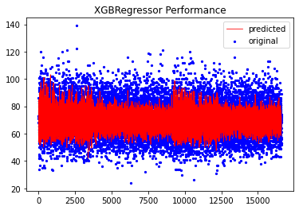
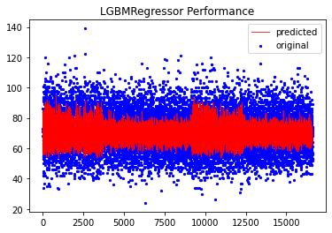
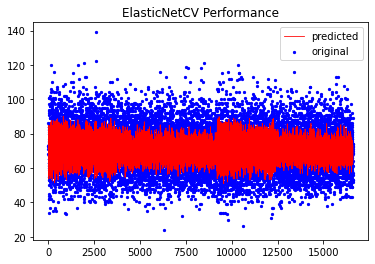
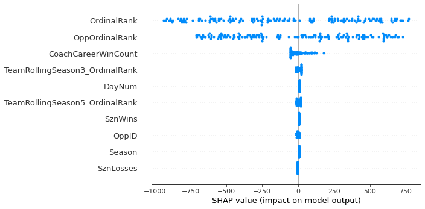
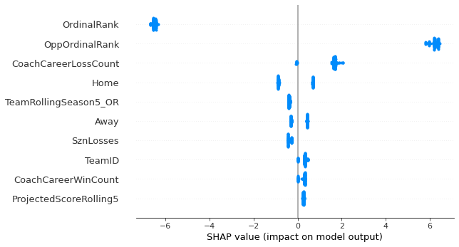
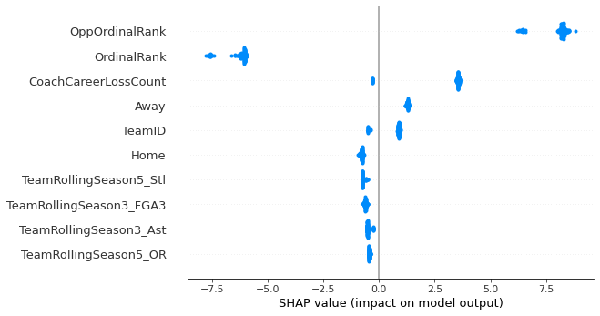
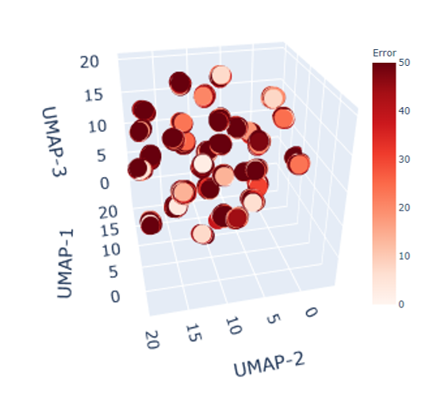

# March Machine Learning Mania 2021 - NCAAM

This repository details and outlines some code relevant to the [Kaggle challenge for 2021 March Madness Men's Tournament score prediction](https://www.kaggle.com/c/ncaam-march-mania-2021).

The team for this was primarily composed of [Aaron Rush]() and [Tony Kelly](https://www.linkedin.com/in/anthonymichaelkelly/).

## Data

The data for this project was provided by Kaggle, and can be found [here](https://www.kaggle.com/c/ncaam-march-mania-2021/data). In addition, there were a number of features that were created for this project as a result of Aaron's extensive collegiate basketball knowledge. These can be summarized in the table below:

## Included Files

Two [Jupyter Notebooks](https://jupyter.org/) are included in this repository:

 - [Feature Engineering]()
 - [Modeling]()

Other exercises, including initial EDA and things like model optimization, are not in this repository. It is on the TO DO list to refactor those into more suitable and reusable examples and to upload to this repository.

## Technical Development

Most development took place using [Google Colaboratory](https://colab.research.google.com/?utm_source=scs-index).

Technical requirements for those interested:
* Python 3.7.12

The package versions in particular can be found in the repository's [`requirements.txt`](requirements.txt)

The commands to install / edit a Google Colab notebook were kept in the notebooks uploaded to this repository, so that this code can be easily used to recreate our environments in GCB.

## Algorithms Used

Initially, more than 15 different regression algorithms were tested. After some initial performance evaluations, 3 were selected based on their untuned performance:

 - [ElasticNet](https://web.stanford.edu/~hastie/Papers/B67.2%20(2005)%20301-320%20Zou%20&%20Hastie.pdf)
 - [LightGBM](https://papers.nips.cc/paper/6907-lightgbm-a-highly-efficient-gradient-boosting-decision-tree)
 - [XGBoost](http://arxiv.org/abs/1603.02754)

In addition to these, 2 ensemble models were created:
* A voting model for all 3 techniques, weighted via each model's performance relative to the others
* A voting model of just gradient boosted techniques, weighted via each model's performance relative to others

The implementations of these techniques are from the [`scikit-learn`](https://scikit-learn.org/stable/), [`lightgbm`](https://lightgbm.readthedocs.io/en/latest/), and [`xgboost`](https://xgboost.readthedocs.io/en/latest/) packages.

## Performance

While our models had strong performance, there was room to improve.

|     Algorithm     | Train and Assembly Time | Mean Average Error | Mean Squared Error | Mean Absolute Percentage Error |  R2  |
|:-----------------:|:-----------------------:|:------------------:|:------------------:|:------------------------------:|:----:|
|     ElasticNet    |          1.98s          |        8.76        |       122.17       |              0.13              | 0.20 |
|      XGBoost      |          162.1s          |        8.91        |       126.93       |              0.13              | 0.17 |
|      LightGBM     |           5.98s          |        8.75        |       122.04       |              0.13              | 0.20 |
| Voting (Gradient) |          167.74s         |        8.75        |       122.27       |              0.13              | 0.20 |
|    Voting (All)   |          169.36s         |        8.74        |       121.89       |              0.13              | 0.20 |

The slight performance edge with a voting model provided confidence that, perhaps with different data, performance could be improved.

Breakdown of model performance below:

  
&nbsp; &nbsp; &nbsp; &nbsp;
  
&nbsp; &nbsp; &nbsp; &nbsp;
  
&nbsp; &nbsp; &nbsp; &nbsp; 
  
&nbsp; &nbsp; &nbsp; &nbsp;
  

## Feature Importances

Feature importances for each of the (3) base models were calculated using [SHAP](http://papers.nips.cc/paper/7062-a-unified-approach-to-interpreting-model-predictions).

For those unfamiliar, there is an [excellent chapter](https://christophm.github.io/interpretable-ml-book/shap.html) in the [Interpretable Machine Learning](https://christophm.github.io/interpretable-ml-book/) that explains SHAP values well.

Here are the individual scatterplots of feature importances for the three base models. We used different [`Explainer`](https://shap.readthedocs.io/en/latest/generated/shap.Explainer.html) objects to create these based on algorithm type.

**ElasticNet SHAP**

**LightGBM SHAP**

**XGBoost SHAP**

## Other Analysis

Other analyses were performed initially, but not included in these uploaded notebooks. These include:

* Clustering analyis
* Basic data eda / visualization
* Feature engineering via correlation analysis, data quality (null samples, etc), bootstrapped features
* Hyperparameter optimization via Bayesian Search

A post-processing clustering analysis was performed to visualize the model's performance on an embedded representation of the data.
[UMAP](https://arxiv.org/abs/1802.03426) was used to embed the data into two dimensions, and a number of iterations were performed until the data began to cluster together, but still preserving its global shape. The [`UMAP`](https://umap-learn.readthedocs.io/en/latest/#) package was used and is included in our [`requirements.txt`](requirements.txt)

## To Do
There are additional items that Aaron and Tony have identified as further to do items for this project.

* Post Kaggle score / placement results
* Refactor and upload EDA and hyperparameter optimization code
* Post a predicted "March Madness" Result bracket using our model(s)
* Investigate [MAPIE](https://github.com/scikit-learn-contrib/MAPIE) for use in regression analysis